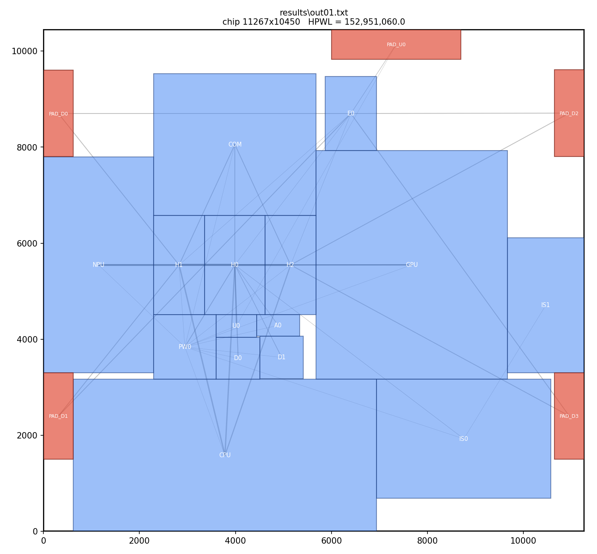
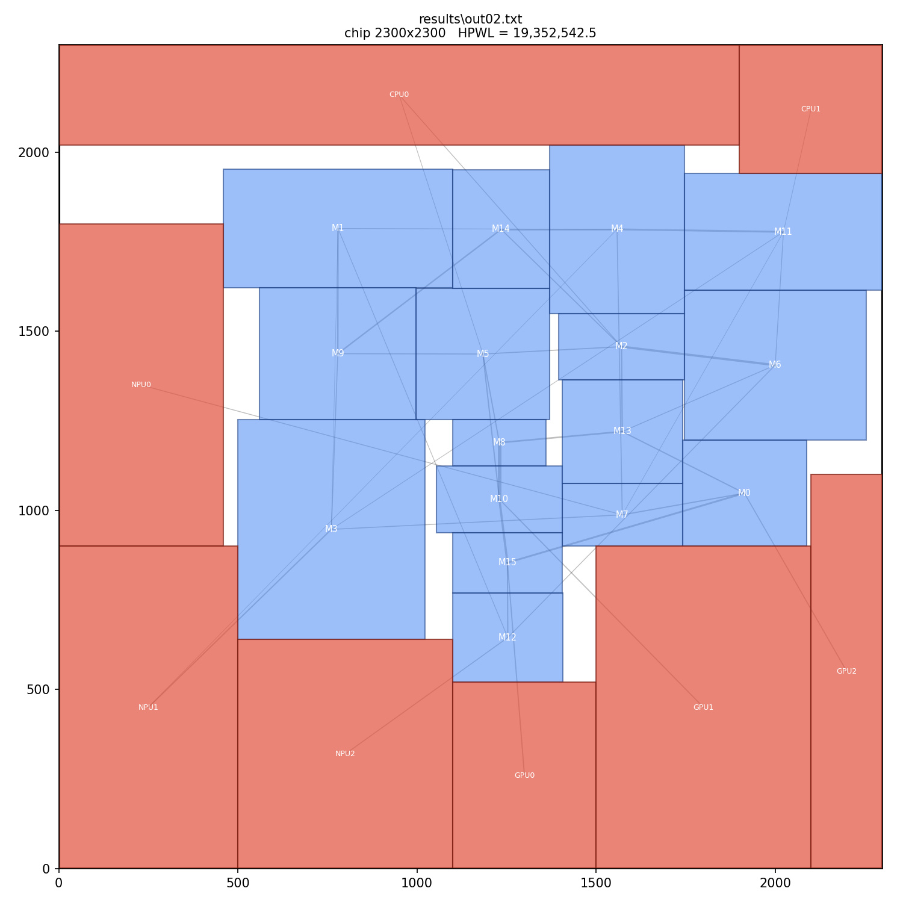
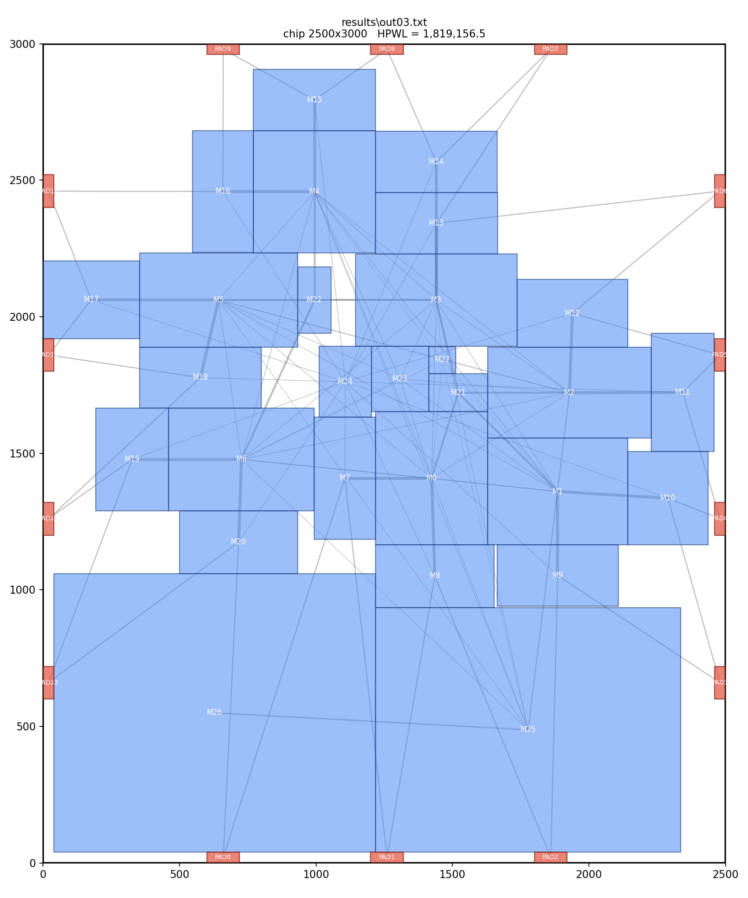
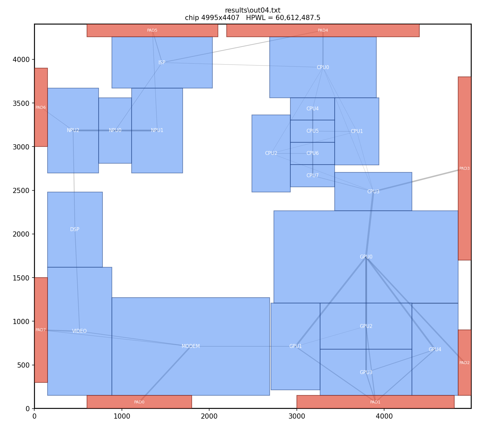
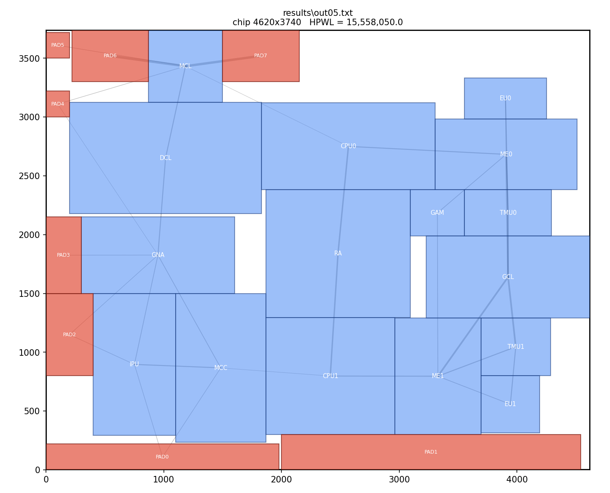
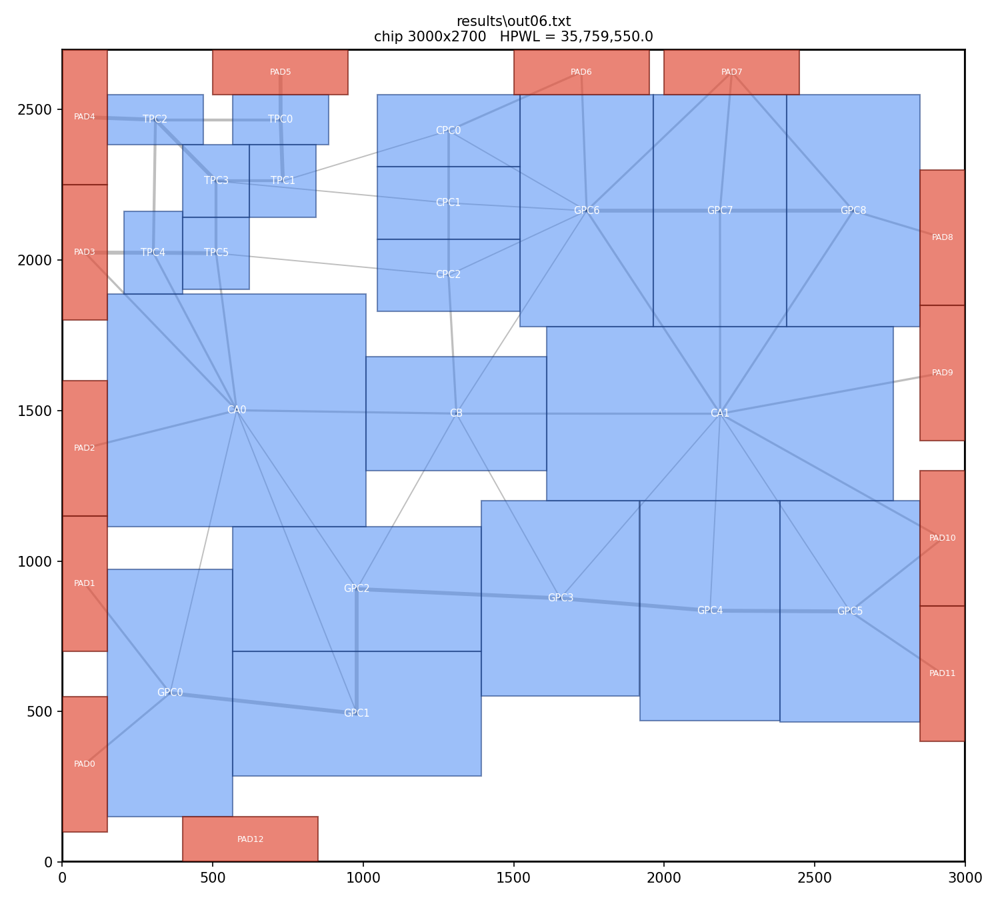

# Fixed-Outline Floorplanner — ICCAD 2023 CAD Contest, Problem D

A clean **Sequence-Pair + Simulated-Annealing** floorplanner for
*Fixed-Outline Floorplanning with Rectilinear Soft Blocks* (ICCAD 2023 CAD
Contest, Problem D), with **multi-threaded parallel restarts**.

Given a fixed chip outline, a set of **soft modules** (only a minimum area is
given — width/height are free within an aspect-ratio limit) and **fixed
modules / pads** (fixed position and size), place every soft module legally so
that the total **HPWL** (half-perimeter wire length, summed over weighted
two-pin nets) is minimised.

## Quick start

```sh
# 1. build solver + checker
make                                        # or see "Build" below

# 2. solve a case (args: input  output  [seconds]  [threads]) and verify it
./prog testcases/case06-input.txt results/out06.txt 60 8
./checker testcases/case06-input.txt results/out06.txt

# 3. one-liner via Makefile: build + solve + verify a single case
make run CASE=06 SEC=60 TH=8

# 4. render the placement to a PNG (needs matplotlib)
python tools/visualize.py testcases/case06-input.txt results/out06.txt result_case06.png
```

> On this Windows box, matplotlib lives in the `botsort` conda env:
> `C:\Users\afk13\miniconda3\envs\botsort\python.exe tools\visualize.py ...`

## Results

Each case run for **30 s on 8 threads**; every result is **legal** (verified
independently by `src/checker.cpp`). Baseline = the author's previous best
solutions for these public cases (cases 1/2/4 of which used rectilinear
polygons). This solver beats all six **using rectangles only**:

| case | this solver | previous best | improvement |
|-----:|------------:|--------------:|:-----------:|
| 1 | 152,951,060   | 158,482,214   | −3.5 % |
| 2 | 19,358,386    | 20,966,740.5  | −7.7 % |
| 3 | 1,851,295     | 1,940,779     | −4.6 % |
| 4 | 60,612,487.5  | 62,810,312.5  | −3.5 % |
| 5 | 15,558,050    | 16,448,450    | −5.4 % |
| 6 | 35,197,150    | 35,864,550    | −1.9 % |

Score in the contest is `(best_HPWL / your_HPWL)^2`, so lower is better; the
30-minute time budget allows much longer runs (and all 32 cores) for further
gains.

## Placement renders

Soft modules (blue) spread toward their connected fixed pads (red); grey lines
are nets (thickness ∝ weight). Rendered by `tools/visualize.py`.

<table>
<tr>
<td align="center"><b>case 1</b><br></td>
<td align="center"><b>case 2</b><br></td>
<td align="center"><b>case 3</b><br></td>
</tr>
<tr>
<td align="center"><b>case 4</b><br></td>
<td align="center"><b>case 5</b><br></td>
<td align="center"><b>case 6</b><br></td>
</tr>
</table>

## How it works

- **Representation** — a Sequence Pair `(posSeq, negSeq)` over the soft modules.
- **Decode (connectivity-aware constructive placement)** — modules are placed in
  SP priority order; each is dropped at the legal candidate position (resting
  against the outline, already-placed rectangles, or fixed pads) that minimises
  the *added* HPWL. Fixed pads are obstacles, so overlap-free legality is
  guaranteed by construction. Incremental HPWL is separable in *x* and *y*, so
  candidates are ranked per-axis and searched best-first with pruning — fully
  coordinate-based, **no pixel scanning**.
- **Simulated annealing** — moves are sequence swaps and module reshapes
  (aspect-ratio changes); wall-clock-based geometric cooling with periodic
  reheating.
- **Parallelism** — each thread is an independent annealer with its own RNG and
  state; the global best across threads is reported. Restarts are
  embarrassingly parallel, so throughput scales ~linearly with cores.

## Build

```sh
make            # builds ./prog (solver) and ./checker
```
or directly:
```sh
g++ -O2 -std=c++17 -static -pthread src/floorplan_sp.cpp -o prog
g++ -O2 -std=c++17 src/checker.cpp -o checker
```
> `-static` avoids a Windows/MinGW crash from loading a mismatched
> `libstdc++-6.dll`.

## Run

```sh
./prog <input> <output> [time_limit_sec] [threads]
# e.g.
./prog testcases/case06-input.txt results/out06.txt 60 8
```
`time_limit_sec` defaults to 60; `threads` defaults to the number of CPU cores.

Verify legality and recompute HPWL independently:
```sh
./checker testcases/case06-input.txt results/out06.txt
```

## Visualize

```sh
python tools/visualize.py testcases/case06-input.txt results/out06.txt result_case6.png
```
Soft modules are blue, fixed pads red, connections grey (thickness ∝ weight).
Requires `matplotlib`.

## Layout

```
src/         floorplan_sp.cpp  – the solver
             checker.cpp       – independent legality + HPWL verifier
tools/       visualize.py      – render a placement to PNG
testcases/   case01..06-input.txt
results/     sample outputs + a reference render
docs/        ProblemD-20230328.pdf  – the official problem statement
legacy/      earlier 2023 contest attempts kept for history
```
